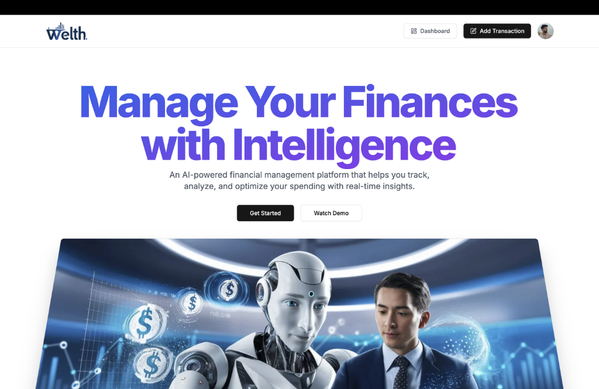
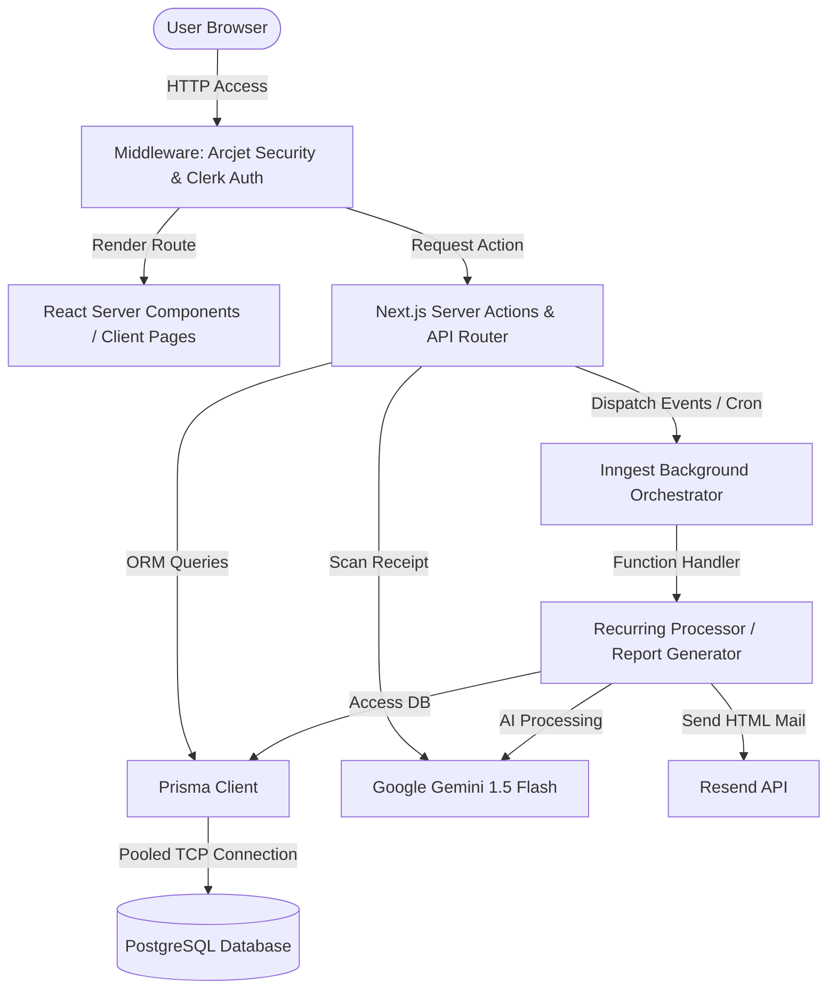
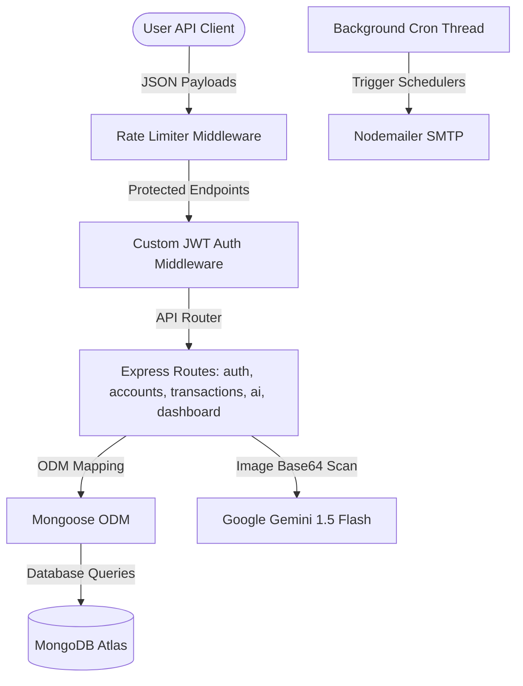

# AI Finance Platform (Multi-Paradigm Workspace)



This repository contains two distinct implementations of an AI-powered personal finance management system. Each project is constructed with its own architectural design and database models to address financial ledger tracking, recurring transactions, security rate-limiting, and AI receipt processing.

---

## 📂 Project Structure

```text
AI FINANCE PLATFORM/
├── ai-finance-platform/            # Next.js 15 Fullstack Serverless Architecture
│   ├── actions/                    # Server Actions for CRUD operations
│   │   ├── account.js              # Create accounts, update default account settings
│   │   ├── budget.js               # Budget threshold verification
│   │   ├── dashboard.js            # Analytical calculations for Recharts
│   │   ├── seed.js                 # Transaction history generator
│   │   ├── send-email.js           # Resend client abstraction
│   │   └── transaction.js          # CRUD for individual transactions
│   ├── app/                        # Next.js App Router folders
│   │   ├── (auth)/                 # Clerk Auth routes (sign-in & sign-up)
│   │   ├── (main)/                 # Authenticated pages (dashboard, account, transaction)
│   │   └── api/                    # API routes (inngest endpoint, seed endpoint)
│   ├── components/                 # React UI widgets (Shadcn UI & Radix)
│   ├── data/                       # Local static UI assets
│   ├── emails/                     # React Email templates
│   ├── lib/                        # Client configs (Prisma, Inngest, Arcjet)
│   ├── prisma/                     # Database schema definitions
│   │   └── schema.prisma           # Prisma configuration (PostgreSQL target)
│   ├── middleware.js               # Middleware chain (Arcjet guard + Clerk auth)
│   └── package.json                # Next.js dependencies
│
└── finance-rebuild/                # Express & Node.js Monolithic API Server
    └── server/
        ├── middleware/             # Express middlewares
        │   ├── auth.js             # Custom JWT decoder middleware
        │   └── rateLimiter.js      # Basic API rate-limiting logic
        ├── models/                 # Mongoose ODM models (MongoDB target)
        │   ├── Account.js          # Bank Account schema
        │   ├── Budget.js           # Spending budget schema
        │   ├── Transaction.js      # Ledger transaction schema
        │   └── User.js             # Local user schema with hashed credentials
        ├── routes/                 # Express API routes
        │   ├── accounts.js         # /api/accounts CRUD endpoints
        │   ├── ai.js               # /api/ai Gemini receipt scan & insights endpoints
        │   ├── auth.js             # /api/auth login/register credentials endpoints
        │   ├── budget.js           # /api/budget budget limit updates
        │   ├── dashboard.js        # /api/dashboard aggregate analytics
        │   └── transactions.js     # /api/transactions CRUD endpoints
        ├── services/               # Internal server helper scripts
        │   └── emailService.js     # Nodemailer SMTP mail template builder
        ├── index.js                # Core Express app setup and server listener
        └── package.json            # Node.js dependencies
```

---

## 🏗️ System Architecture Design

### Next.js Architecture (`ai-finance-platform`)
A serverless-first layout utilizing edge middleware security, third-party authentication, React Server Components (RSCs), and server actions that directly execute SQL queries on a relational PostgreSQL database.



### Express Architecture (`finance-rebuild/server`)
A classic client-server model built around a Node.js runtime. Requests pass through local rate-limiting and JWT authentication controllers before querying a NoSQL document database.



---

## 🔄 Data Flow Diagrams

### Data Flow: AI Receipt Scanning

```mermaid
sequenceDiagram
    autonumber
    actor User
    participant Frontend as Frontend Interface
    participant Controller as Express Endpoint / Next Server Action
    participant Gemini as Google Gemini AI (1.5 Flash)
    database DB as Database (Postgres or MongoDB)
    
    User->>Frontend: Select receipt image and click upload
    Frontend->>Controller: POST image payload (Base64 or memory stream)
    Controller->>Gemini: Send Base64 image + Prompt requesting detailed JSON format
    Note over Gemini: Gemini parses transaction details,<br/>infers category, and returns JSON string
    Gemini-->>Controller: Return JSON text format
    Controller->>Controller: Clean JSON output & Parse to Object
    Controller->>DB: Write transaction details to database
    Controller-->>Frontend: Return transaction confirmation object
    Frontend-->>User: Display transaction details and success toast
```

### Data Flow: Automated Recurring Ledger Operations

```mermaid
sequenceDiagram
    autonumber
    participant Scheduler as Scheduler Engine (Inngest Cron / node-cron)
    participant Worker as Background Execution Worker
    database DB as Database (PostgreSQL / MongoDB)
    participant Email as Email Dispatcher (Resend / Nodemailer)
    
    Scheduler->>Worker: Trigger scheduled routine (Daily/Monthly)
    Worker->>DB: Query for due recurring transactions
    DB-->>Worker: Return transactions list
    
    loop For each due transaction
        Worker->>DB: Insert new transaction copy with "(Recurring)" tag
        Worker->>DB: Increment/Decrement related bank account balance
        Worker->>DB: Advance transaction's nextRecurringDate timestamp
    end
    
    alt If Monthly Summary Report
        Worker->>DB: Fetch aggregate monthly totals
        Worker->>Email: Deliver HTML financial report summary to user's inbox
    end
```

---

## 🛠️ Tech Stack Explanation

### Core Platforms
*   **Next.js 15 (React 19 RC)**: Fullstack framework implementing hybrid server/client page hydration, edge routing middleware, and zero-api Server Actions.
*   **Express & Node.js**: Traditional server runtime hosting lightweight JSON RESTful endpoints.
*   **PostgreSQL**: Relational database chosen for strict schema validation, foreign keys, and decimal monetary precision.
*   **MongoDB**: NoSQL document database chosen for quick database schema changes and unstructured receipt JSON writes.

### Security, Auth & Infrastructure
*   **Clerk Authentication**: A third-party Identity provider managing sessions, social sign-ins, and multi-factor auth on the frontend.
*   **jsonwebtoken & bcryptjs**: Custom security utilities in the Express backend that hash user credentials and issue cryptographic tokens for session tracking.
*   **Arcjet**: Security middleware protecting the Next.js edge route from bots and WAF attacks.
*   **Inngest**: Event-driven worker queuing system running background workflows and cron events.
*   **Google Gemini (Gemini-1.5-Flash)**: AI model processing raw receipt images to extract transaction values.
*   **Resend & Nodemailer**: Email services for automated monthly spending reports and budget alert notifications.

---

## ☁️ Paid Cloud Services vs. Free Tier Alternatives

You can configure and deploy this entire multi-paradigm setup using only free tier services:

| Service / Tool | Current Stack Component | Free Tier Limitations | Free Tier Alternatives | Free Target Setup |
| :--- | :--- | :--- | :--- | :--- |
| **Authentication** | Clerk Auth | Free up to 10,000 monthly active users (MAU). | **NextAuth.js (Auth.js)** | Replace Clerk with NextAuth.js configured on a free PostgreSQL user schema. |
| **SQL Database** | Prisma Client (PostgreSQL) | Managed hosting has data caps and connection thresholds. | **Supabase DB** or **Neon Free Tier** | Deploy a free database on Supabase or Neon to get a permanent PostgreSQL database connection URL. |
| **NoSQL Database** | Mongoose (MongoDB) | Local database running on development servers. | **MongoDB Atlas M0 Free Cluster** | Spin up an M0 shared cluster on MongoDB Atlas (completely free, no credit card required) and copy the URI. |
| **Background Jobs** | Inngest Event Engine | Free tier limits up to 50,000 run triggers per month. | **node-cron** or **Upstash QStash** | Use local `node-cron` libraries (for Express) or Upstash QStash queues (for Next.js) to schedule API calls. |
| **Security Shield** | Arcjet Middleware | Free tier covers up to 24,000 requests per month. | **Next.js Edge Middleware with Upstash Rate Limiting** | Build basic rate-limiting middleware in Next.js using a free Upstash Redis instance. |
| **AI LLM API** | Google Gemini SDK | Free rate limits: 15 Requests/Min, 1 Million Tokens/Min. | **Google AI Studio (Gemini Free Tier)** | Register at Google AI Studio to secure a developer API key for Gemini 1.5 Flash. |
| **Email Clients** | Resend API | Free up to 3,000 emails/month (100/day maximum). | **Gmail SMTP with App Passwords** or **Brevo SMTP** | Swap the Resend client for Nodemailer using Gmail SMTP settings or Brevo's SMTP server (300 free emails/day). |

---

## 🚀 Step-by-Step Free Tier Deployment Guide

### Deployment A: Next.js Platform (`ai-finance-platform`) on **Vercel**

1. **Provision Database**:
   * Create a free account on [Neon](https://neon.tech/) or [Supabase](https://supabase.com/) and create a PostgreSQL database.
   * Copy the database connection URL (`DATABASE_URL` and `DIRECT_URL`).
2. **Apply Migrations**:
   * Navigate to `ai-finance-platform` on your local machine and deploy your schema definitions:
     ```bash
     npx prisma migrate deploy
     npx prisma generate
     ```
3. **Register Authentication Suite**:
   * Set up a developer dashboard on [Clerk](https://clerk.com/) to obtain `NEXT_PUBLIC_CLERK_PUBLISHABLE_KEY` and `CLERK_SECRET_KEY`.
4. **Push Project to GitHub**:
   * Commit all code changes inside `ai-finance-platform` and push the subfolder to a GitHub repository.
5. **Launch Vercel Project**:
   * Log into [Vercel](https://vercel.com/) and import the GitHub repository.
   * Set **Root Directory** to `ai-finance-platform`.
   * Add the following **Environment Variables**:
     * `DATABASE_URL` (PostgreSQL pooled URL)
     * `DIRECT_URL` (PostgreSQL direct connection URL)
     * `NEXT_PUBLIC_CLERK_PUBLISHABLE_KEY` (Clerk publishable key)
     * `CLERK_SECRET_KEY` (Clerk secret key)
     * `NEXT_PUBLIC_CLERK_SIGN_IN_URL` = `/sign-in`
     * `NEXT_PUBLIC_CLERK_SIGN_UP_URL` = `/sign-up`
     * `GEMINI_API_KEY` (Gemini API key)
     * `ARCJET_KEY` (Arcjet key, or remove Arcjet from `middleware.js` if running without it)
     * `RESEND_API_KEY` (Resend client key)
   * Click **Deploy**.

---

### Deployment B: Node.js Express Server (`finance-rebuild/server`) on **Render**

1. **Provision MongoDB Database**:
   * Create a free account on [MongoDB Atlas](https://www.mongodb.com/cloud/atlas).
   * Create a new **M0 Free Cluster**. Under network access settings, whitelist all IP configurations (`0.0.0.0/0`) to allow Render services to connect.
   * Copy the MongoDB URI string.
2. **Push Project to GitHub**:
   * Push the `finance-rebuild/server` code to a GitHub repository (ensure `.env` and `node_modules` are in your `.gitignore`).
3. **Launch Render Web Service**:
   * Log into [Render](https://render.com/) and choose **New + > Web Service**.
   * Link your GitHub repository.
   * Configure the service:
     * **Name**: `ai-finance-backend`
     * **Language**: `Node`
     * **Root Directory**: `finance-rebuild/server`
     * **Build Command**: `npm install`
     * **Start Command**: `node index.js`
     * **Instance Type**: **Free**
   * Add the following **Environment Variables**:
     * `PORT` = `10000`
     * `MONGODB_URI` = `mongodb+srv://...` (your MongoDB Atlas connection string)
     * `JWT_SECRET` = `your_secure_random_jwt_secret_phrase`
     * `GEMINI_API_KEY` = `your_gemini_api_key`
     * `EMAIL_USER` = `your_smtp_sender_email@gmail.com`
     * `EMAIL_PASS` = `your_smtp_app_password`
     * `EMAIL_HOST` = `smtp.gmail.com`
     * `EMAIL_PORT` = `587`
   * Click **Create Web Service**.
